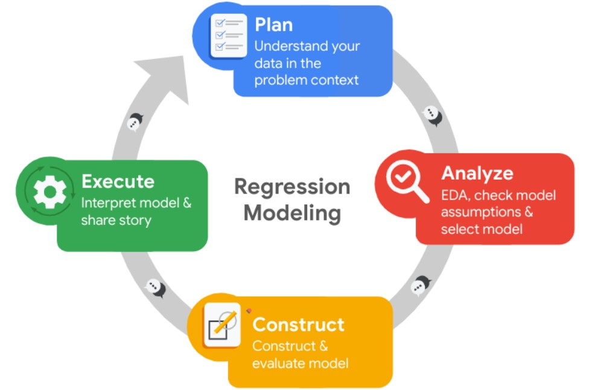

# Google Advanced Data Analytics Case study: What’s likely to make the employee leave the company?

This is my capstone project for Google's Advanced Data Analytics Professional Certificate.

# Table of Contents

1. [Introduction](#1-introduction)
2. [Scenario](#2-scenario)
3. [PACE stages](#3-pace-stages)
4. [Result](#4-result)

# 1. Introduction
This is a case study for completing [Google Advanced Data Analytics Professional Certificate](https://www.coursera.org/professional-certificates/google-advanced-data-analytics). In this case study, you work for a fictional company, Salifort Motors. The task is to deploy different models to analyze a dataset and generate business insights for your stakeholders. They have the following question: what’s likely to make the employee leave the company?

# 2. Scenario
The HR department at Salifort Motors wants to take some initiatives to improve employee satisfaction levels at the company. They collected data from employees, but now they don’t know what to do with it. They refer to us as a data analytics professional and ask us to provide data-driven suggestions based on our understanding of the data.

Our goals in this project are to analyze the data collected by the HR department and to build a model that predicts whether or not an employee will leave the company.

If we can predict employees likely to quit, it might be possible to identify factors that contribute to their leaving. Because it is time-consuming and expensive to find, interview, and hire new employees, increasing employee retention will be beneficial to the company.

The dataset that we'll be using contains 15,000 rows and 10 columns for the variables listed below, refer to its source on [Kaggle](https://www.kaggle.com/datasets/mfaisalqureshi/hr-analytics-and-job-prediction?select=HR_comma_sep.csv).

Variable  |Description |
-----|-----|
satisfaction_level|Employee-reported job satisfaction level [0&ndash;1]|
last_evaluation|Score of employee's last performance review [0&ndash;1]|
number_project|Number of projects employee contributes to|
average_monthly_hours|Average number of hours employee worked per month|
time_spend_company|How long the employee has been with the company (years)
Work_accident|Whether or not the employee experienced an accident while at work
left|Whether or not the employee left the company
promotion_last_5years|Whether or not the employee was promoted in the last 5 years
Department|The employee's department
salary|The employee's salary (U.S. dollars)

# 3. PACE stages

Detailed process in the Jupyter Notebook [Here](https://github.com/Amit-K-M/Capstone-project-for-Google-Advanced-Data-Analytics-cert/blob/main/Capstone_project_Activity_%20Course%207%20Salifort%20Motors%20project%20lab.ipynb).

# 4. Result
Executive summary 

### Summary of model results

**Logistic Regression**

The logistic regression model achieved precision of 80%, recall of 83%, f1-score of 80% (all weighted averages), and accuracy of 83%, on the test set.

**Tree-based models**

After conducting feature engineering, the decision tree model achieved AUC of 93.8%, precision of 87.0%, recall of 90.4%, f1-score of 88.7%, and accuracy of 96.2%, on the test set. The random forest modestly outperformed the decision tree model.

**Feature Importance**

All of the models agree that the most important features are at least `satisfaction_level`, `number_project`, `tenure`, `average_monthly_hours`, and `last_evaluation`. Which is closely related to the insights from the EDA.

---

## Technical Skills Utilized
### Programming Languages
- **Python**

### Python Libraries
- **Data Manipulation & Analysis**: `numpy`, `pandas`
- **Statistical Analysis**: `scipy`, `statsmodels`
- **Data Visualization**: `seaborn`, `matplotlib`
- **Machine Learning**: `scikit-learn`

### Machine Learning Models Used
- **Regression**: Logistic Regression
- **Classification Models**:  Decision Trees, Random Forest

---

## Conclusion and Recommendations

This project serves as a practical application of data science concepts, analytics, and machine learning techniques to solve a real-world classification problem. By following a structured approach, this repository showcases a methodical execution of data-driven decision-making, making it a valuable addition to any data analyst’s portfolio.

The models and the feature importances extracted from the models confirm that employees at the company are overworked.

To reduce the number of employees leaving the company, the company should consider the following:
- Cap the number of projects an employee can work on at a time.
- Reward employees for working longer hours and for working on more projects, or don't require them to do so.
- High evaluation score shouldn't just be based on the number of projects and hours worked, but also on the quality of the work.
